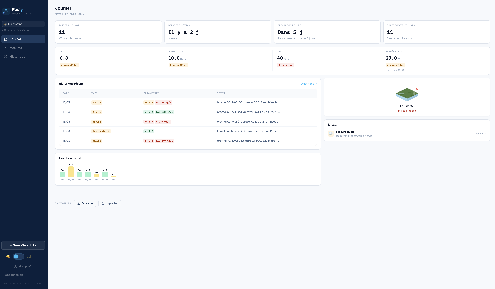
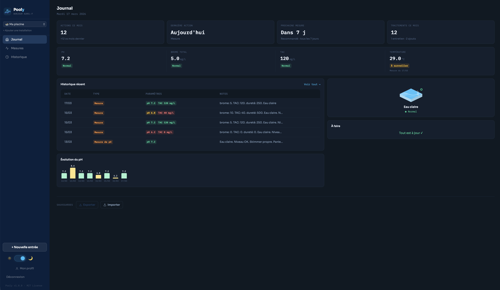
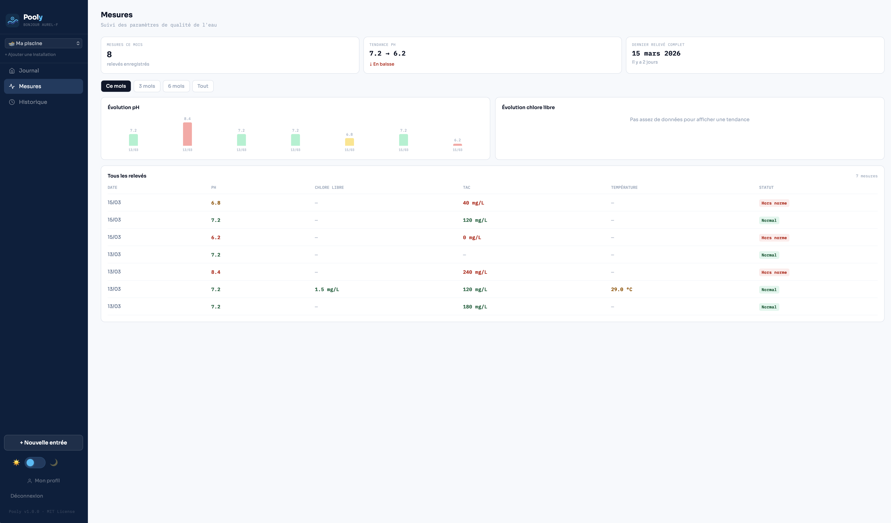
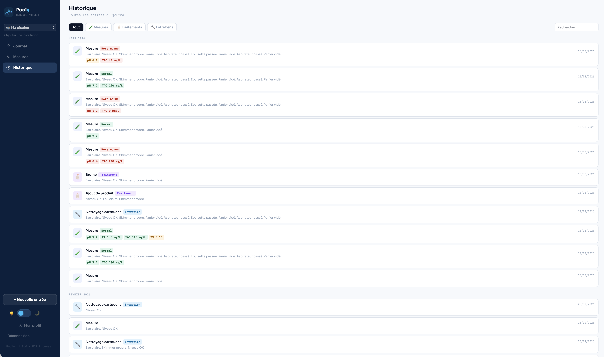
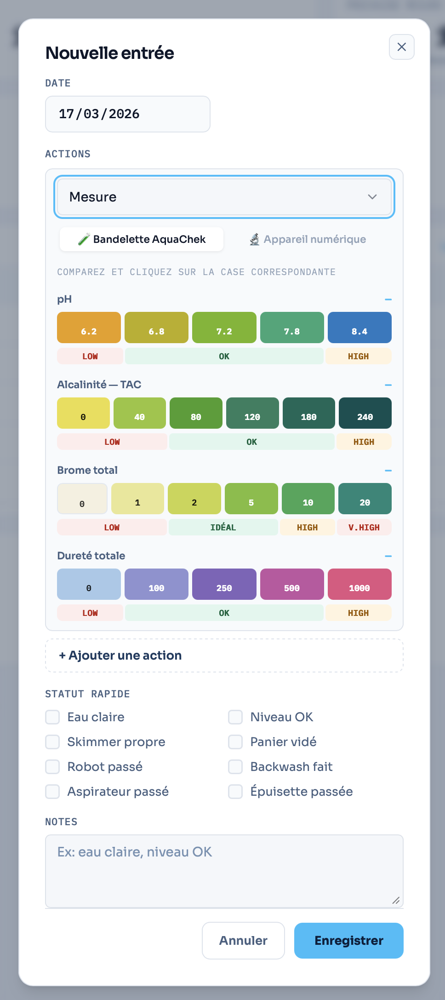

<div align="center">


# Pooly

**🇫🇷 Journal d'entretien pour piscines et spas — self-hosted**
**🇬🇧 Pool & spa maintenance tracker — self-hosted**

[](https://github.com/aurel-f/pooly/releases)
[](LICENSE)
[](docker-compose.yml)
[](https://fastapi.tiangolo.com)
[](https://react.dev)

</div>

---

## 🇫🇷 Français

### Table des matières
- [Présentation](#-présentation)
- [Fonctionnalités](#-fonctionnalités)
- [Screenshots](#-screenshots)
- [Installation rapide](#-installation-rapide)
- [Configuration](#-configuration)
- [Stack technique](#-stack-technique)
- [Contribuer](#-contribuer)
- [Licence](#-licence)

---

### 🌊 Présentation

Pooly est une application web **self-hosted** pour suivre l'entretien de vos piscines et spas. Enregistrez vos mesures, traitements et entretiens depuis un dashboard clair — vos données restent chez vous.

Conçu pour les propriétaires qui veulent garder le contrôle sans complexité : une commande Docker et c'est lancé.

---

### ✨ Fonctionnalités

- **Dashboard complet** — KPIs, paramètres en temps réel, indicateur visuel de l'état de l'eau
- **Saisie par bandelette AquaChek** — nuancier interactif pour pH, TAC, Brome et Dureté
- **Saisie par appareil numérique** — inputs décimaux avec validation des plages
- **Multi-installation** — gérez plusieurs piscines et spas avec des plages de référence adaptées
- **Piscine & Spa** — brome ou chlore, plages idéales différenciées
- **Historique complet** — timeline groupée par mois, filtres par type, recherche full-text
- **Page Mesures** — suivi de l'évolution des paramètres dans le temps
- **Mode sombre** — thème clair, sombre ou automatique (préférence système)
- **PWA** — installable sur mobile, bottom navigation, bottom sheet modal
- **Self-hosted & privé** — aucun cloud tiers, aucun tracking, vos données restent chez vous

---

### 📸 Screenshots

<div align="center">

| Journal — Mode clair | Journal — Mode sombre |
|---|---|
|  |  |

| Mesures | Historique |
|---|---|
|  |  |

| Nouvelle entrée — Entretien | Nouvelle entrée — Bandelette AquaChek |
|---|---|
|  |  |

</div>

---

### 🚀 Installation rapide

**Prérequis** : Docker et Docker Compose installés sur votre machine.

```bash
# 1. Clonez le dépôt
git clone https://github.com/aurel-f/pooly.git
cd pooly

# 2. Configurez l'environnement
cp .env.example .env
nano .env  # Définissez vos mots de passe et secrets

# 3. Lancez Pooly
docker compose up -d

# 4. Ouvrez dans votre navigateur
open http://localhost:8090
```

L'application est accessible sur `http://localhost:8090`. Créez votre compte à la première connexion.

---

### ⚙️ Configuration

Copiez `.env.example` en `.env` et ajustez les valeurs :

| Variable | Description | Défaut |
|---|---|---|
| `POSTGRES_PASSWORD` | Mot de passe PostgreSQL | — |
| `SESSION_SECRET` | Clé secrète pour les sessions | — |
| `APP_BASE_URL` | URL publique de l'app | `http://localhost:8090` |
| `ALLOWED_ORIGINS` | Origines CORS autorisées | `http://localhost:8090` |
| `DEBUG` | Mode debug (logs reset links) | `false` |

> ⚠️ **Ne jamais committer votre fichier `.env`**. Il est déjà dans le `.gitignore`.

---

### 🛠 Stack technique

| Couche | Technologie |
|---|---|
| Frontend | React 19, Vite, Tailwind CSS |
| Backend | FastAPI, SQLModel, Python 3.12 |
| Base de données | PostgreSQL 16 |
| Auth | Sessions cookie (httpOnly, same_site=strict) |
| Déploiement | Docker Compose |
| Typographie | Sora + IBM Plex Mono |

---

### 🤝 Contribuer

Les contributions sont les bienvenues ! Voici comment participer :

```bash
# Forkez le repo, puis :
git clone https://github.com/aurel-f/pooly.git
cd pooly
git checkout -b feature/ma-fonctionnalite

# Faites vos modifications, puis :
git commit -m "feat: description de la fonctionnalité"
git push origin feature/ma-fonctionnalite
# Ouvrez une Pull Request
```

**Types de contributions appréciées :**
- 🐛 Corrections de bugs
- ✨ Nouvelles fonctionnalités
- 🌍 Traductions
- 📸 Screenshots et démos
- 📖 Améliorations de la documentation

Consultez les [issues ouvertes](https://github.com/aurel-f/pooly/issues) pour voir ce sur quoi travailler.

---

### 📄 Licence

Distribué sous licence **MIT**. Voir [LICENSE](LICENSE) pour plus d'informations.

---

---

## 🇬🇧 English

### Table of contents
- [Overview](#-overview)
- [Features](#-features)
- [Screenshots](#-screenshots-1)
- [Quick start](#-quick-start)
- [Configuration](#-configuration-1)
- [Tech stack](#-tech-stack)
- [Contributing](#-contributing)
- [License](#-license)

---

### 🌊 Overview

Pooly is a **self-hosted** web application to track the maintenance of your pools and spas. Log your water measurements, treatments and maintenance tasks from a clean dashboard — your data stays on your own server.

Designed for owners who want full control without complexity: one Docker command and you're up and running.

---

### ✨ Features

- **Full dashboard** — KPIs, real-time water parameters, visual water quality indicator
- **AquaChek test strip input** — interactive color chart for pH, Alkalinity, Bromine and Hardness
- **Digital device input** — decimal inputs with range validation
- **Multi-installation** — manage multiple pools and spas with adapted reference ranges
- **Pool & Spa** — bromine or chlorine, differentiated ideal ranges
- **Full history** — monthly timeline, type filters, full-text search
- **Measurements page** — track parameter trends over time
- **Dark mode** — light, dark or automatic theme (system preference)
- **PWA** — installable on mobile, bottom navigation, bottom sheet modal
- **Self-hosted & private** — no third-party cloud, no tracking, your data stays yours

---

### 📸 Screenshots

<div align="center">

| Dashboard — Light mode | Dashboard — Dark mode |
|---|---|
|  |  |

| Measurements | History |
|---|---|
|  |  |

| New entry — Maintenance | New entry — AquaChek test strip |
|---|---|
|  |  |

</div>

---

### 🚀 Quick start

**Requirements**: Docker and Docker Compose installed on your machine.

```bash
# 1. Clone the repository
git clone https://github.com/aurel-f/pooly.git
cd pooly

# 2. Set up environment
cp .env.example .env
nano .env  # Set your passwords and secrets

# 3. Start Pooly
docker compose up -d

# 4. Open in your browser
open http://localhost:8090
```

The app is available at `http://localhost:8090`. Create your account on first login.

---

### ⚙️ Configuration

Copy `.env.example` to `.env` and adjust the values:

| Variable | Description | Default |
|---|---|---|
| `POSTGRES_PASSWORD` | PostgreSQL password | — |
| `SESSION_SECRET` | Session secret key | — |
| `APP_BASE_URL` | Public app URL | `http://localhost:8090` |
| `ALLOWED_ORIGINS` | Allowed CORS origins | `http://localhost:8090` |
| `DEBUG` | Debug mode (logs reset links) | `false` |

> ⚠️ **Never commit your `.env` file**. It is already in `.gitignore`.

---

### 🛠 Tech stack

| Layer | Technology |
|---|---|
| Frontend | React 19, Vite, Tailwind CSS |
| Backend | FastAPI, SQLModel, Python 3.12 |
| Database | PostgreSQL 16 |
| Auth | Cookie sessions (httpOnly, same_site=strict) |
| Deployment | Docker Compose |
| Typography | Sora + IBM Plex Mono |

---

### 🤝 Contributing

Contributions are welcome! Here's how to get involved:

```bash
# Fork the repo, then:
git clone https://github.com/aurel-f/pooly.git
cd pooly
git checkout -b feature/my-feature

# Make your changes, then:
git commit -m "feat: describe the feature"
git push origin feature/my-feature
# Open a Pull Request
```

**Appreciated contribution types:**
- 🐛 Bug fixes
- ✨ New features
- 🌍 Translations
- 📸 Screenshots and demos
- 📖 Documentation improvements

Check the [open issues](https://github.com/aurel-f/pooly/issues) to find something to work on.

---

### 📄 License

Distributed under the **MIT License**. See [LICENSE](LICENSE) for more information.

---

<div align="center">
  <sub>Made with ♥ · Self-hosted · Open source</sub>
</div>
